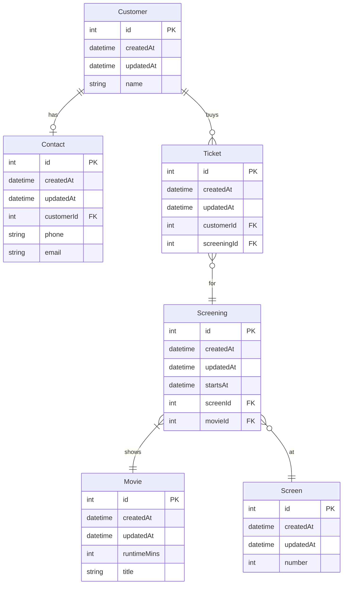

# ERD

```mermaid
erDiagram
    Customer ||--o| Contact : has
    Customer ||--o{ Ticket : buys
    Screening }|--|| Movie : shows
    Screening }o--|| Screen : at
    Ticket }o--|| Screening : for

    Customer {
        int id PK
        datetime createdAt
        datetime updatedAt
        string name
    }

    Contact {
        int id PK
        datetime createdAt
        datetime updatedAt
        int customerId FK
        string phone
        string email
    }

    Screening {
        int id PK
        datetime createdAt
        datetime updatedAt
        datetime startsAt
        int screenId FK
        int movieId FK
    }

    Screen {
        int id PK
        datetime createdAt
        datetime updatedAt
        int number
    }

    Ticket {
        int id PK
        datetime createdAt
        datetime updatedAt
        int customerId FK
        int screeningId FK
    }

    Movie {
        int id PK
        datetime createdAt
        datetime updatedAt
        int runtimeMins
        string title
    }
```
