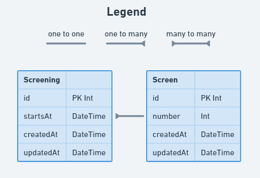

# Movie & Screening relationship

## Instructions

- Create the `Screen` model
- Add the relevant relationship between `Screening` and `Screen`.
- Use [this documentation](https://www.prisma.io/docs/concepts/components/prisma-schema/relations/one-to-many-relations) as a guide.

