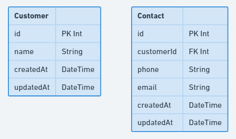

# Customer & Contact



The `Customer` model has already been created for you in the `prisma/schema.prisma` file to give you a working example of how to define models with properties & attributes.

## Instructions

- Create the `Contact` model based on the diagram above. Don't add any relationships yet.
- Use the existing `Customer` model as a reference to help you extract the useful information from [this documentation](https://www.prisma.io/docs/concepts/components/prisma-schema/data-model#defining-models).

## Development Process

1. Work through the instructions of this requirement
2. Run `npx prisma generate` in your terminal to recompile the prisma client package.
   1. [What does this command do?](../resources/prisma-generate.md)
3. Edit the `seed` function in the `prisma/seed.js` file to create a record for the model / relation you added in the first step.
   1. [How to create records](https://www.prisma.io/docs/concepts/components/prisma-client/crud#create-a-single-record)
   2. [What is seeding?](../resources/db-seeding.md)
4. Run `npx prisma migrate dev --create-only --skip-seed --name contact` to create a new migration file.
   1. [What does this command do?](../resources/db-migrations.md)
5. Run `npx prisma migrate reset` to apply your migration files to the database and run the seed function.
6. Go to your database instance in ElephantSQL, open the `Browser` section, click the `Table queries` drop-down, select the model you've been working on and click `Execute` to check that your data is being inserted correctly.

## An explanation of `@id @default(autoincrement())`

Each of your models will have some properties & attributes that look the same. These are `id`, `createdAt` and `updatedAt` - let's understand what these are.

`id` is the identity number of the record that gets created - we never need to give this information to Prisma, the database will take care of it automatically. This is thanks to the `@id` and `@default(autoincrement())` attributes.

- `@id` tells Prisma that this property is the primary key of the model.
- `@default()` tells Prisma that we want to provide a default value for this property when a record gets created. The value we provide it is `autoincrement()`
- `autoincrement()` is a function that Prisma uses to automatically assign the next available integer as the value to the ID property.

If we want to provide a hard default value to something, we would pass it in to `@default`. For example, to make every created record have an id of 7, our model might look like this:

```js
model MyModel {
    id  Int     @id @default(7)
}
```

This won't work in practice because identities need to be unique, but in theory it would ensure that every `MyModel` record that was created would have an id of 7. Let's change it to use autoincrement below:

```js
model MyModel {
    id  Int     @id @default(autoincrement())
}
```

This will now make sure that the first `MyModel` that gets created will have an id of 1, the second will have an id of 2, etc.
