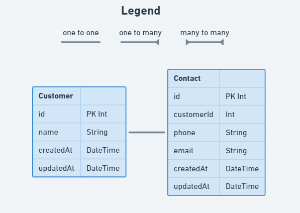

# Customer & Contact relation

## Instructions

- Add the required relation between `Customer` and `Contact`. Note the additional property added to the `Contact` model.

- [Use this documentation](https://www.prisma.io/docs/concepts/components/prisma-schema/relations/one-to-one-relations) as a guide for updating the schema.
- [Use this documentation](https://www.prisma.io/docs/concepts/components/prisma-client/relation-queries#nested-writes) as a guide for updating the seed file.

## Development Process

1. Work through the instructions of this requirement
2. Run `npx prisma generate` in your terminal to recompile the prisma client package.
    1. [What does this command do?](../resources/prisma-generate.md)
3. Edit the `seed` function in the `prisma/seed.js` file to create a record for the model / relation you added in the first step.
    1. [How to create records](https://www.prisma.io/docs/concepts/components/prisma-client/crud#create-a-single-record)
    2. [What is seeding?](../resources/db-seeding.md)
4. Run `npx prisma migrate dev --create-only --skip-seed --name contact_relation` to create a new migration file.
    1. [What does this command do?](../resources/db-migrations.md)
5. Run `npx prisma migrate reset` to apply your migration files to the database and run the seed function.
6. Go to your database instance in ElephantSQL, open the `Browser` section, click the `Table queries` drop-down, select the model you've been working on and click `Execute` to check that your data is being inserted correctly.